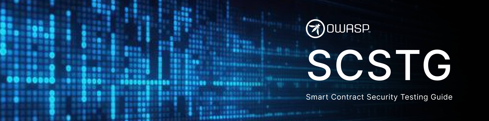

# OWASP Smart Contract Security Testing Guide

## Introduction

The OWASP Smart Contract Security Testing Guide (SCSTG) aims to provide a comprehensive framework and methodology for testing the security of smart contracts, decentralized applications (dApps), and EVM-based blockchain systems.

SCSTG is designed to help developers, auditors, and security professionals effectively identify and mitigate vulnerabilities, ensuring the robustness and reliability of smart contracts in decentralized ecosystems.

We extend our gratitude to the organizations and individuals who have supported the project through time, resources, or funding. You can find the list of contributors and supporters on our "[Supporter](https://github.com/OWASP/owasp-scstg/blob/main/SUPPORTERS.md)" page.

**Please [log issues](https://github.com/OWASP/owasp-scstg/issues) if you identify any bugs or have suggestions for improvement. Based on discussions in the issues, we may ask you to [open a pull request](https://github.com/OWASP/owasp-scstg/pulls).**

## Initial Draft Version - 0.0.1

The latest stable version is version 0.0.1 (dated September 2024), available here:

* [OWASP Smart Contract Security Testing Guide 0.0.1 English (PDF)](https://github.com/OWASP/owasp-scstg/releases/download/v0.0.1/OWASP_Smart_Contract_Security_Testing_Guide-0.0.1_en.pdf)

The master branch of this repository contains the "bleeding edge version," which may include in-progress changes or other updates.

## Guide Objectives

The SCSTG was developed with the following goals in mind:

1. **Define Comprehensive Testing Methodologies**: Establish a detailed methodology for identifying vulnerabilities specific to smart contracts and blockchain ecosystems.
2. **Standardize Security Testing Practices**: Provide a standardized approach for testing common vulnerabilities such as reentrancy, integer overflows/underflows, access control flaws, and economic attacks.
3. **Enhance Testing Toolchains**: Offer guidance on leveraging existing security tools, such as fuzzers, symbolic execution tools, and static/dynamic analyzers, for smart contract testing.
4. **Promote a Holistic Testing Approach**: Emphasize end-to-end testing, including on-chain behavior, business logic, and interaction with decentralized systems.
5. **Educate Developers and Testers**: Help developers and testers understand the nuances of blockchain security testing and implement secure testing practices.
6. **Keep Up with Evolving Threats**: Continuously update the guide to address new threats, attack vectors, and blockchain innovations.
7. **Encourage Open Collaboration**: Promote collaboration among developers, security experts, and researchers to improve the quality and applicability of the guide.

## License

The entire project content is licensed under the **[Creative Commons Attribution-Share Alike v4.0](LICENSE.md)** license.
